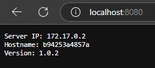

# Link do DockerHub:
https://hub.docker.com/r/ostrowski2000/lab6
lub
```bash
docker pull ostrowski2000/lab6
```
# Użyte polecenia:
```bash
gh repo create
eval "$(ssh-agent -s)"
ssh-add ~/.ssh/id_ed25519
echo $SSH_AUTH_SOCK
code Dockerfile
DOCKER_BUILDKIT=1 docker build --build-arg VERSION=1.0.2 --ssh default -t lab6 .
docker run -p 8080:80 lab6
```
# Wynik działania kontenera:


# Przesyłanie obrazu do repozytorium na github:
```bash
cat ~/token.txt | docker login ghcr.io -u Esco808 --password-stdin
docker tag lab6 ghcr.io/esco808/lab6
docker push ghcr.io/esco808/lab6
```

# Przesyłanie obrazu na dockerhub:
```bash
docker tag lab6 ostrowski2000/lab6
docker push ostrowski2000/lab6
```
