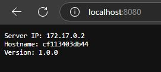
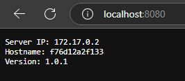
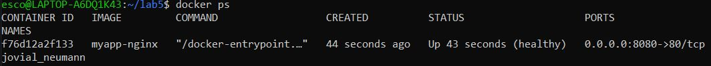

# Link do DockerHub:
https://hub.docker.com/r/ostrowski2000/lab5 lub docker pull ostrowski2000/lab5

# Użyte polecenia:
```bash
docker init
touch main.go
code main.go
code Dockerfile
docker build --build-arg VERSION=1.0.0 -t myapp .
docker run -p 8080:8080 myapp
```

```bash
code Dockerfile
touch default.conf
code default.conf
touch start.sh
code start.sh
docker build --build-arg VERSION=1.0.1 -t myapp-nginx .
docker run --rm -dp 8080:80 myapp-nginx
docker ps
```

